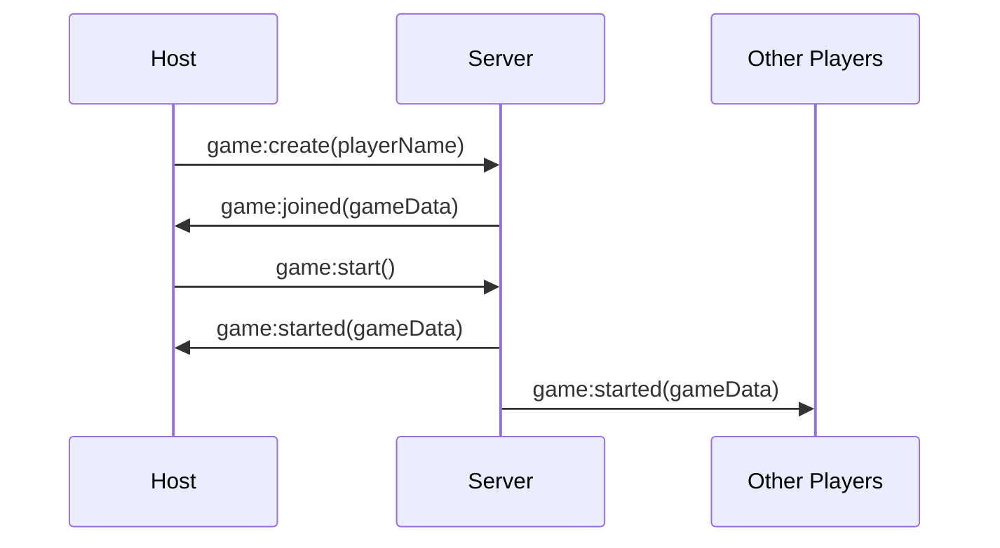
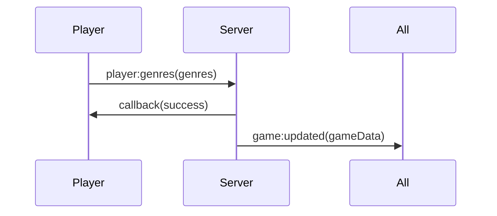
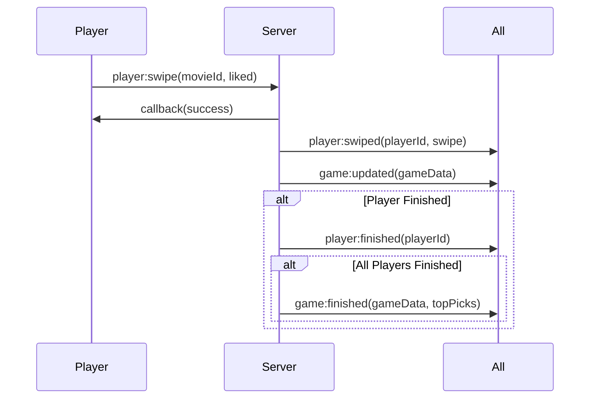
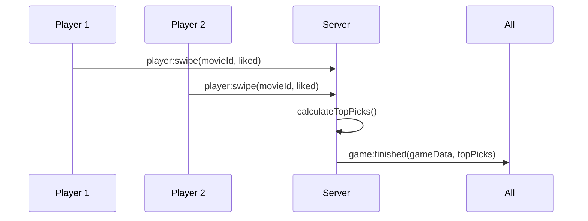

# 🎬 YourNxtWatch - Multiplayer Movie Game

A fun, real-time multiplayer game where friends swipe through movies together and discover their next watch! Built with React, Node.js, Socket.IO, and TMDb API.

## ✨ Features

- **🎮 Real-time Multiplayer**: Join games with room codes, no login required
- **🎭 Genre Selection**: Each player picks their favorite movie genres
- **🔄 Swipe Interface**: Intuitive left/right swipe on movie cards
- **📊 Smart Matching**: AI-powered algorithm finds top 3 movies based on swipe similarity
- **🎬 Rich Movie Data**: Powered by TMDb with trailers and streaming info
- **📱 Mobile-Friendly**: Responsive design optimized for mobile devices
- **⚡ Real-time Sync**: Live updates using Socket.IO

## 🛠 Tech Stack

### Frontend
- **React 18** with TypeScript
- **Vite** for fast development
- **Socket.IO Client** for real-time communication
- **React Router** for navigation
- **Framer Motion** for animations
- **Lucide React** for icons

### Backend
- **Node.js** with TypeScript
- **Express** server
- **Socket.IO** for real-time features
- **TMDb API** for movie data
- **In-memory storage** (no database required)

### Shared
- **TypeScript** interfaces and types
- **Monorepo** structure with npm workspaces

## 🚀 Quick Start

### Prerequisites
- Node.js 18+ 
- npm or yarn
- TMDb API key (optional, uses mock data without it)

### Installation

1. **Clone the repository**
   ```bash
   git clone https://github.com/yourusername/yournxtwatch.git
   cd yournxtwatch
   ```

2. **Install dependencies**
   ```bash
   npm install
   ```

3. **Set up environment variables**
   ```bash
   cp env.example .env
   ```
   
   Edit `.env` and add your TMDb API key:
   ```env
   TMDB_API_KEY=your_tmdb_api_key_here
   ```

4. **Start development servers**
   ```bash
   npm run dev
   ```

   This starts both the client (port 5173) and server (port 3001).

### Development Commands

```bash
# Start both client and server
npm run dev

# Start only client
npm run dev:client

# Start only server  
npm run dev:server

# Build all packages
npm run build

# Run tests
npm test

# Lint code
npm run lint
```

## 🎯 How to Play

1. **Create or Join a Game**
   - Visit the homepage
   - Create a new game or join with a room code
   - Share the room code with friends

2. **Select Genres**
   - Each player chooses their favorite movie genres
   - Wait for all players to be ready

3. **Start Swiping**
   - Swipe right to like a movie
   - Swipe left to pass
   - Watch real-time progress of other players

4. **See Results**
   - When everyone finishes, see the top 3 movies
   - View trailers and streaming options
   - Plan your next movie night!

## 📁 Project Structure

```
yournxtwatch/
├── client/                 # React frontend
│   ├── src/
│   │   ├── components/    # React components
│   │   ├── pages/         # Page components
│   │   ├── contexts/      # React contexts
│   │   ├── hooks/         # Custom hooks
│   │   └── services/      # API services
│   └── public/            # Static assets
├── server/                # Node.js backend
│   ├── src/
│   │   ├── services/      # Business logic
│   │   ├── routes/        # API routes
│   │   └── index.ts       # Server entry point
├── shared/                # Shared types
│   └── src/
│       └── index.ts       # TypeScript interfaces
├── .github/               # GitHub Actions
└── README.md
```

## 🏗 Technical Overview

### Architecture

YourNxtWatch is a **real-time multiplayer movie recommendation game** built with a **full-stack TypeScript monorepo**:

```
yournxtwatch/
├── client/          # React + Vite frontend
├── server/          # Node.js + Express + Socket.IO backend  
└── shared/          # Shared TypeScript types/interfaces
```

### Technology Stack

#### **Frontend (Client)**
- **React 18** with TypeScript
- **Vite** for fast development and building
- **Socket.IO Client** for real-time communication
- **Lucide React** for icons
- **CSS Custom Properties** for theming

#### **Backend (Server)**
- **Node.js** with TypeScript
- **Express.js** for HTTP endpoints
- **Socket.IO** for real-time bidirectional communication
- **Axios** for external API calls (TMDB)
- **UUID** for unique identifiers

#### **Shared**
- **TypeScript** interfaces and types
- **Game logic** models and configurations

### Server Architecture

#### **Core Services**

**1. GameManager Service**
```typescript
class GameManager {
  private games: Map<string, Game> = new Map();
  private tmdbService: TMDBService;
}
```

**Responsibilities:**
- **Game Lifecycle Management**: Create, join, start, end games
- **Player Management**: Add/remove players, track player states
- **Movie Management**: Fetch and distribute movies based on player genres
- **Results Calculation**: Calculate collaborative top picks
- **In-Memory Storage**: Store active games in memory

**Key Methods:**
- `createGame()` - Creates new game with host player
- `joinGame()` - Adds players to existing game
- `startGame()` - Fetches movies and starts gameplay
- `setPlayerGenres()` - Records player genre preferences
- `recordSwipe()` - Records movie swipes and checks completion
- `calculateTopPicks()` - Computes collaborative recommendations

**2. TMDBService**
```typescript
class TMDBService {
  private baseUrl = 'https://api.themoviedb.org/3';
  private apiKey = process.env.TMDB_API_KEY;
}
```

**Responsibilities:**
- **Movie Data Fetching**: Get movies by genre from TMDB API
- **Fallback Handling**: Provide mock data when API unavailable
- **Data Transformation**: Convert TMDB format to internal Movie interface

**Key Methods:**
- `getMoviesByGenre()` - Fetches movies for specific genre
- `getMovieDetails()` - Gets detailed movie information
- `getMockMovies()` - Provides fallback mock data

#### **Socket.IO Event Flow**

**Client → Server Events:**
```typescript
interface ClientToServerEvents {
  'game:create': (playerName: string, callback: (game: Game) => void) => void;
  'game:join': (roomCode: string, playerName: string, callback: (game: Game) => void) => void;
  'game:start': (callback: (success: boolean) => void) => void;
  'player:genres': (genres: string[], callback: (success: boolean) => void) => void;
  'player:swipe': (movieId: number, liked: boolean, callback: (success: boolean) => void) => void;
  'player:disconnect': () => void;
}
```

**Server → Client Events:**
```typescript
interface ServerToClientEvents {
  'game:joined': (game: Game) => void;
  'game:updated': (game: Game) => void;
  'game:started': (game: Game) => void;
  'game:finished': (game: Game, topPicks: TopPick[]) => void;
  'player:joined': (player: Player) => void;
  'player:left': (playerId: string) => void;
  'player:swiped': (playerId: string, swipe: MovieSwipe) => void;
  'player:finished': (playerId: string) => void;
  'error': (message: string) => void;
}
```

### Client Architecture

#### **Core Components**

**1. GameContext (State Management)**
```typescript
interface GameContextType {
  socket: Socket | null;
  game: Game | null;
  currentPlayer: Player | null;
  isConnected: boolean;
  error: string | null;
  createGame: (playerName: string) => Promise<void>;
  joinGame: (roomCode: string, playerName: string) => Promise<void>;
  startGame: () => Promise<void>;
  setPlayerGenres: (genres: string[]) => Promise<void>;
  swipeMovie: (movieId: number, liked: boolean) => Promise<void>;
  clearError: () => void;
}
```

**Responsibilities:**
- **Socket Connection Management**: Establish and maintain WebSocket connection
- **Game State Management**: Track current game and player state
- **Event Handling**: Listen for server events and update local state
- **Error Handling**: Manage and display error messages
- **Action Dispatching**: Send user actions to server

**2. GamePage (Main Game UI)**
**State Management:**
```typescript
const [selectedGenres, setSelectedGenres] = useState<string[]>([]);
const [currentMovieIndex, setCurrentMovieIndex] = useState(0);
const [isSwiping, setIsSwiping] = useState(false);
const [isStarting, setIsStarting] = useState(false);
```

**Flow Logic:**
- **Host Detection**: `isHost = currentPlayer?.id === game?.players[0]?.id`
- **Genre Selection**: `needsGenreSelection = !currentPlayerInGame?.genres || currentPlayerInGame.genres.length === 0`
- **Game Progress**: `hasFinishedSwiping = currentMovieIndex >= game?.movies.length`

### Game Flow Architecture

#### **Phase 1: Game Creation & Host Control**



**Server Logic:**
1. **Game Creation**: `GameManager.createGame()` creates game with host as first player
2. **Host Control**: Only host can call `game:start` event
3. **Movie Fetching**: `fetchMoviesForGame()` gets movies based on all player genres
4. **State Transition**: Game status changes from 'waiting' → 'playing'

#### **Phase 2: Genre Selection (All Players)**



**Client Logic:**
1. **Genre Selection UI**: Grid of genre buttons with toggle functionality
2. **Validation**: Must select at least one genre
3. **Server Update**: `setPlayerGenres()` sends genres to server
4. **State Sync**: `game:updated` event updates all clients

#### **Phase 3: Movie Swiping (Independent Play)**



**Server Logic:**
1. **Swipe Recording**: `recordSwipe()` stores movie preference
2. **Completion Check**: `checkGameEnd()` verifies if all players finished
3. **Results Calculation**: `calculateTopPicks()` computes collaborative recommendations
4. **Auto-Finish**: Game automatically ends when all players finish

**Client Logic:**
1. **Movie Display**: Shows current movie with poster, title, overview
2. **Swipe Actions**: Like/Pass buttons with visual feedback
3. **Progress Tracking**: Shows current movie index and total count
4. **Completion Detection**: `hasFinishedSwiping` triggers waiting screen

#### **Phase 4: Results & Collaboration**



**Results Logic:**
1. **Score Calculation**: Movies scored by number of players who liked them
2. **Collaborative Ranking**: Top 3 movies based on group preferences
3. **Player Attribution**: Shows which players liked each movie
4. **Auto-Display**: Results appear automatically when all finish

### Data Flow Architecture

#### **Game State Management**

```typescript
interface Game {
  id: string;
  roomCode: string;
  players: Player[];
  movies: Movie[];
  status: GameStatus; // 'waiting' | 'playing' | 'finished'
  createdAt: number;
  startedAt?: number;
  endedAt?: number;
  topPicks?: TopPick[];
}
```

**State Synchronization:**
- **Server Authority**: Server maintains authoritative game state
- **Event Broadcasting**: All state changes broadcast to all players
- **Client Caching**: Clients cache game state for UI rendering
- **Real-time Updates**: Socket events keep all clients synchronized

#### **Player State Management**

```typescript
interface Player {
  id: string;
  name: string;
  genres: string[];
  swipes: MovieSwipe[];
  hasFinished: boolean;
}
```

**Player Tracking:**
- **Host Identification**: First player in array is always host
- **Genre Preferences**: Each player's selected genres
- **Swipe History**: Complete record of movie preferences
- **Completion Status**: Whether player has finished all movies

### Error Handling & Resilience

#### **Server-Side Error Handling**
- **API Failures**: TMDB service falls back to mock data
- **Game Validation**: Prevents invalid game states
- **Player Management**: Handles disconnections gracefully
- **Memory Management**: Cleans up abandoned games

#### **Client-Side Error Handling**
- **Connection Loss**: Automatic reconnection attempts
- **State Recovery**: Rejoins game on reconnection
- **User Feedback**: Clear error messages and loading states
- **Graceful Degradation**: UI remains functional during issues

### Performance Considerations

#### **Server Optimization**
- **In-Memory Storage**: Fast access for active games
- **Efficient Broadcasting**: Only send necessary data updates
- **Connection Pooling**: Socket.IO handles multiple connections
- **API Caching**: TMDB responses cached to reduce external calls

#### **Client Optimization**
- **State Minimization**: Only store essential game data
- **Efficient Rendering**: React optimizations for real-time updates
- **Image Optimization**: Movie posters loaded on-demand
- **Memory Management**: Clean up completed games

This architecture provides a robust, real-time multiplayer experience with clear separation of concerns, efficient state management, and graceful error handling.

## 🔧 Configuration

### Environment Variables

| Variable | Description | Default |
|----------|-------------|---------|
| `PORT` | Server port | `3001` |
| `TMDB_API_KEY` | TMDb API key | `''` (uses mock data) |
| `CLIENT_URL` | Frontend URL | `http://localhost:5173` |

### TMDb API Setup

1. Visit [TMDb](https://www.themoviedb.org/settings/api)
2. Create an account and request an API key
3. Add your API key to `.env`
4. Restart the server

## 🚀 Deployment

YourNxtWatch is configured for **automatic deployment** using GitHub Actions!

### **Quick Deploy (Recommended)**

1. **Fork this repository** to your GitHub account
2. **Set up GitHub Secrets** (see [DEPLOYMENT.md](DEPLOYMENT.md#step-1-prepare-your-repository))
3. **Push to main branch** - GitHub Actions will automatically deploy to Vercel and Railway

### **Manual Deployment**

#### **Frontend (Vercel)**
```bash
cd client
vercel --prod
```

#### **Backend (Railway)**
```bash
cd server
railway up
```

### **GitHub Actions CI/CD**

The project includes automated deployment workflows:
- ✅ **Build & Test**: Runs on every PR and push
- ✅ **Auto-Deploy**: Deploys to Vercel/Railway on main branch push
- ✅ **Health Checks**: Verifies deployment success
- ✅ **Rollback**: Automatic rollback on deployment failures

### **Deployment URLs**

Once deployed, you'll get:
- **Frontend**: `https://yournxtwatch.vercel.app`
- **Backend**: `https://yournxtwatch-server.railway.app`
- **Health Check**: `https://yournxtwatch-server.railway.app/health`

📖 **For detailed deployment instructions, see [DEPLOYMENT.md](DEPLOYMENT.md)**

## 🤝 Contributing

1. Fork the repository
2. Create a feature branch (`git checkout -b feature/amazing-feature`)
3. Commit your changes (`git commit -m 'Add amazing feature'`)
4. Push to the branch (`git push origin feature/amazing-feature`)
5. Open a Pull Request

## 📝 License

This project is licensed under the MIT License - see the [LICENSE](LICENSE) file for details.

## 🙏 Acknowledgments

- [TMDb](https://www.themoviedb.org/) for movie data
- [Socket.IO](https://socket.io/) for real-time communication
- [Vite](https://vitejs.dev/) for fast development
- [Framer Motion](https://www.framer.com/motion/) for animations

## 📞 Support

- 🐛 [Report a bug](https://github.com/yourusername/yournxtwatch/issues)
- 💡 [Request a feature](https://github.com/yourusername/yournxtwatch/issues)
- 📧 Email: your-email@example.com

---

Made with ❤️ for movie lovers everywhere!
